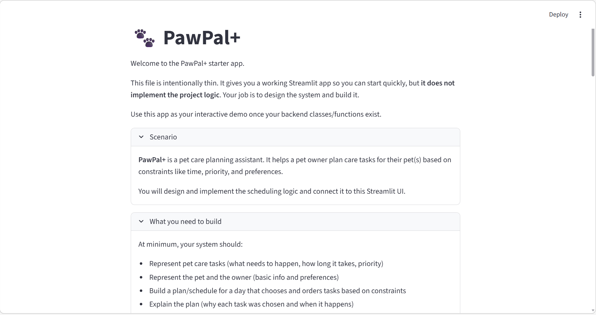
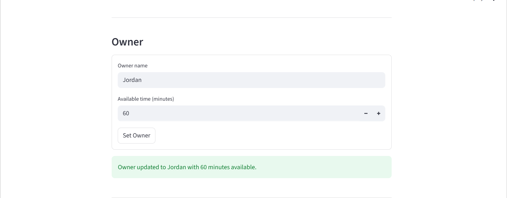
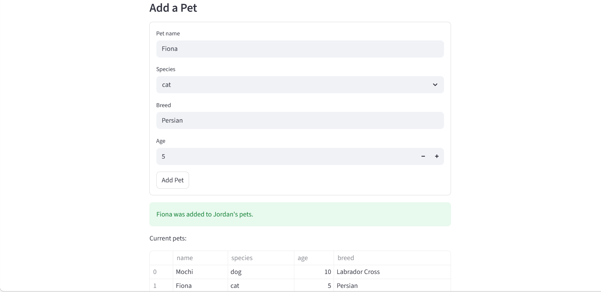
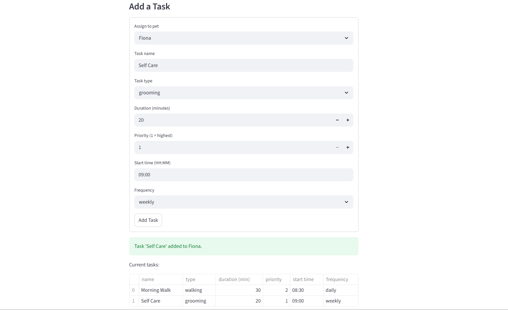
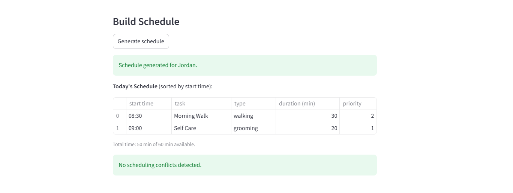
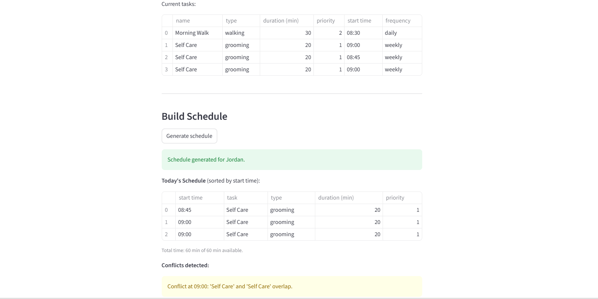

# PawPal+ (Module 2 Project)

**PawPal+** is a Streamlit app that helps a pet owner plan daily care tasks for their pet. It generates a smart daily schedule based on available time and task priority, and explains which tasks were chosen and why.

## Demo



**Owner setup**


**Adding a pet**


**Adding a task**


**Generated schedule**


**Conflict warning**


## Scenario

A busy pet owner needs help staying consistent with pet care. PawPal+ helps them by:

- Tracking pet care tasks (walks, feeding, medication, enrichment, grooming, etc.)
- Considering constraints such as available time and task priority
- Producing a sorted daily plan and warning about scheduling conflicts

## Features

- **Owner and pet management** — set up an owner with available time and add multiple pets
- **Task scheduling** — tasks are prioritized and fitted into the owner's available time
- **Sorting by time** — the daily plan is always displayed in chronological order
- **Filtering** — view tasks by pet name or completion status
- **Recurring tasks** — daily and weekly tasks automatically schedule the next occurrence when marked complete
- **Conflict detection** — tasks with the same start time trigger a plain-language warning in the UI

## What you will build

Your final app should:

- Let a user enter basic owner + pet info
- Let a user add/edit tasks (duration + priority at minimum)
- Generate a daily schedule/plan based on constraints and priorities
- Display the plan clearly (and ideally explain the reasoning)
- Include tests for the most important scheduling behaviors

## Getting started

### Setup

```bash
python -m venv .venv
source .venv/bin/activate  # Windows: .venv\Scripts\activate
pip install -r requirements.txt
```

### Suggested workflow

1. Read the scenario carefully and identify requirements and edge cases.
2. Draft a UML diagram (classes, attributes, methods, relationships).
3. Convert UML into Python class stubs (no logic yet).
4. Implement scheduling logic in small increments.
5. Add tests to verify key behaviors.
6. Connect your logic to the Streamlit UI in `app.py`.
7. Refine UML so it matches what you actually built.

## Smarter Scheduling

The `Scheduler` class implements four key algorithms:

- **Sorting** — `sort_by_time()` sorts tasks by `start_time` in HH:MM format, with priority as a tiebreaker
- **Filtering** — `filter_tasks()` accepts an optional `pet_name` and/or `completed` flag to narrow down the scheduled task list
- **Recurrence** — `Task.mark_complete()` returns a new `Task` with the next `due_date` for `daily` (+1 day) or `weekly` (+7 days) tasks, or `None` for one-off tasks
- **Conflict detection** — `detect_conflicts()` flags any two tasks in the plan that share the same `start_time`, returning a list of warning strings

## Testing PawPal+

Run the test suite with:

```bash
python -m pytest tests/test_pawpal.py -v
```

The tests cover:

- Task completion status changing correctly
- Recurring daily tasks generating the next occurrence
- Sorting tasks into chronological order
- Conflict detection for duplicate start times
- Filtering tasks by pet name and completion status
- Edge cases such as pets with no tasks and empty schedules

**Confidence level: ★★★★☆**
Core scheduling behaviors are tested and passing. The main area not yet covered is the Streamlit UI layer.
